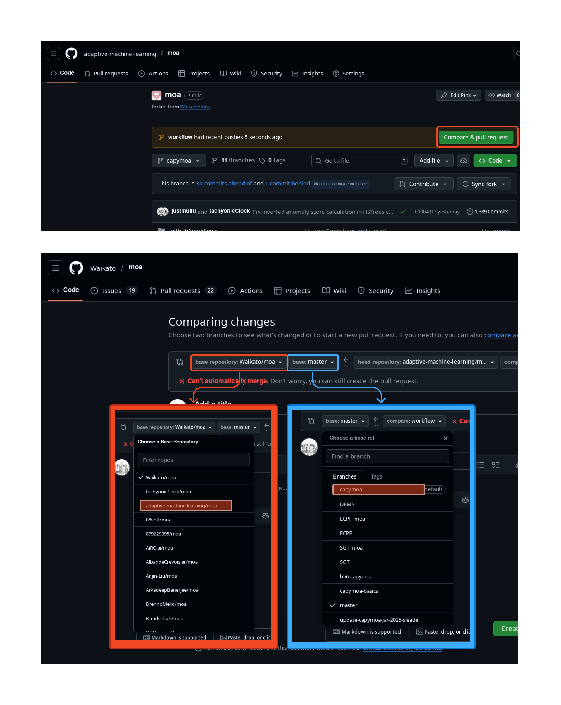

# MOA (CapyMOA Edition)

This is a fork of the [Waikato/moa](https://github.com/Waikato/moa) repository that is
packaged with CapyMOA providing additional functionality to MOA and better integration
with CapyMOA.

A long term project goal is to merge all CapyMOA changes back into the upstream
`Waikato/moa:master` branch. This will be an iterative process and much slower than
CapyMOA development. For now, this fork exists to facilitate CapyMOA development without
blocking on upstream MOA changes. Changes from this branch shall be cherry-picked into
upstream MOA as appropriate. This fork shall then be rebased on-top of the latest MOA
upstream changes periodically.

To create a pull request into MOA CapyMOA edition branch, create a PR from your feature
branch into `adaptive-machine-learning/moa:capymoa`:


To build MOA for use with CapyMOA run:
```bash
cd moa
mvn package -DskipTests -Dmaven.javadoc.skip=true -Dlatex.skipBuild=true
```
This will create a `target/moa-*-jar-with-dependencies.jar` file that can be used by
CapyMOA. To let CapyMOA know where this file is, set the `CAPYMOA_MOA_JAR` environment
variable to the path of this file.

You can do this temporarily in your terminal session with:
```bash
export CAPYMOA_MOA_JAR=/path/to/moa/target/moa-*-jar-with-dependencies.jar
```
To check that CapyMOA can find MOA, run:
```bash
python -c "import capymoa; capymoa.about()"
# CapyMOA 0.10.0
#   CAPYMOA_DATASETS_DIR: .../datasets
#   CAPYMOA_MOA_JAR:      .../moa/moa/target/moa-2024.07.2-SNAPSHOT-jar-with-dependencies.jar
#   CAPYMOA_JVM_ARGS:     ['-Xmx8g', '-Xss10M']
#   JAVA_HOME:            /usr/lib/jvm/java-21-openjdk
#   MOA version:          aa955ebbcbd99e9e1d19ab16582e3e5a6fca5801ba250e4d164c16a89cf798ea
#   JAVA version:         21.0.7
```


# MOA (Massive Online Analysis)
[](https://travis-ci.org/Waikato/moa)
[](https://mvnrepository.com/artifact/nz.ac.waikato.cms)
[](https://hub.docker.com/r/waikato/moa)
[](https://www.gnu.org/licenses/gpl-3.0)

![MOA][logo]

[logo]: http://moa.cms.waikato.ac.nz/wp-content/uploads/2014/11/LogoMOA.jpg "Logo MOA"

MOA is the most popular open source framework for data stream mining, with a very active growing community ([blog](http://moa.cms.waikato.ac.nz/blog/)). It includes a collection of machine learning algorithms (classification, regression, clustering, outlier detection, concept drift detection and recommender systems) and tools for evaluation. Related to the WEKA project, MOA is also written in Java, while scaling to more demanding problems.

http://moa.cms.waikato.ac.nz/

## Using MOA

* [Getting Started](http://moa.cms.waikato.ac.nz/getting-started/)
* [Building from the source](https://moa.cms.waikato.ac.nz/tutorial-6-building-moa-from-the-source/)
* [Documentation](http://moa.cms.waikato.ac.nz/documentation/)
* [About MOA](http://moa.cms.waikato.ac.nz/details/)

MOA performs BIG DATA stream mining in real time, and large scale machine learning. MOA can be extended with new mining algorithms, and new stream generators or evaluation measures. The goal is to provide a benchmark suite for the stream mining community. 

## Mailing lists
* MOA users: http://groups.google.com/group/moa-users
* MOA developers: http://groups.google.com/group/moa-development

## Citing MOA
If you want to refer to MOA in a publication, please cite the following JMLR paper: 

> Albert Bifet, Geoff Holmes, Richard Kirkby, Bernhard Pfahringer (2010);
> MOA: Massive Online Analysis; Journal of Machine Learning Research 11: 1601-1604 


## Building MOA for CapyMOA

You can now upload the build artifact from the GitHub Actions workflow. **Make sure to unzip it!**

> These steps assume you have Java installed and maven installed. If you don't
> have maven installed, you can download it from
> [here](https://maven.apache.org/download.cgi). You can achieve the same
> outcome with IntelliJ IDEA by [building moa with the IDE](https://moa.cms.waikato.ac.nz/tutorial-6-building-moa-from-the-source/) (The linked doc is a  little out of date)
> and [packaging it as a single jar file](https://stackoverflow.com/questions/1082580/how-to-build-jars-from-intellij-idea-properly).

You can compile moa as a single jar file with all dependencies included by running the following command in the `moa` directory:
```bash
cd ./moa
mvn compile assembly:single
```

If successful, the jar file will be built to a file like this `moa/target/moa-2023.04.1-SNAPSHOT-jar-with-dependencies.jar` with a different date.

One way to verify that the jar file was built correctly is to run the following command:
```bash
java -jar ./moa/target/moa-2023.04.1-SNAPSHOT-jar-with-dependencies.jar
```
This should start the MOA GUI.

